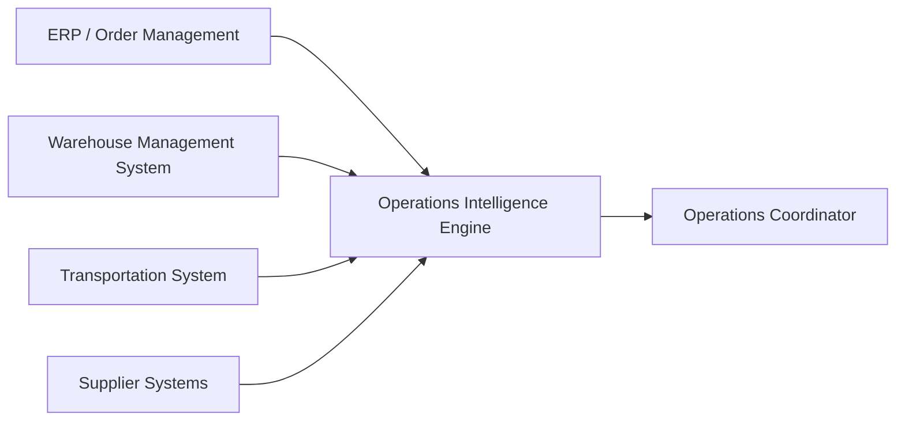

# Operations Intelligence Engine

A production-oriented TypeScript backend that maintains an explainable view of operational state across an industrial distribution network.

The engine consumes business events originating from systems such as order management, warehouse management, supplier, and transportation systems. It combines those facts to answer operational questions that no individual source system can answer alone.

The project is organized around operational decisions rather than CRUD resources.

## Primary user

The initial user is an operations coordinator responsible for ensuring customer orders ship on time.

Their work requires understanding disruptions across customer demand, warehouse inventory, inbound supply, and transportation without manually reconciling several independent systems.

## First operational question

> Which open customer orders cannot currently be fulfilled by their required ship date, and what operational conditions are preventing fulfillment?

The system must return more than a blocked status. It should explain:

* which order lines are affected;
* the required and available quantities;
* the projected shortfall;
* which inventory, reservation, or inbound-supply conditions caused it;
* what changed to produce the current result.

## Business context

The initial domain is a midsize industrial distributor.

The company:

* purchases industrial products from suppliers;
* stores inventory across multiple warehouses;
* accepts customer orders containing one or more product lines;
* commits available and expected supply to customer demand;
* experiences shortages, supplier delays, inventory discrepancies, and competing orders;
* needs operations employees to understand which customer commitments are at risk.

The distributor's customers are primarily other businesses. A delayed industrial component may prevent a factory, repair company, construction operation, or other customer from completing its own work.

## Where the engine fits

Existing operational systems remain authoritative for the business facts they manage.

Examples include:

* an ERP or order-management system for customer orders and commercial commitments;
* a warehouse management system for physical inventory and warehouse activity;
* supplier systems for purchase-order commitments and inbound supply;
* transportation systems for shipment status and delays.

The Operations Intelligence Engine sits downstream from these systems.



The upstream systems provide facts. The engine derives operational impact and explanations.

## First vertical slice

The first slice follows a customer order that depends on an inbound supplier shipment.

Initially:

* current warehouse inventory and expected inbound inventory are sufficient to fulfill the order by its required ship date;
* the order is considered fulfillable.

Then:

* the inbound shipment is delayed beyond the required ship date;
* projected supply becomes insufficient;
* the order becomes blocked;
* the engine identifies the affected SKU, quantity shortfall, delayed shipment, and relevant dates.

This scenario will become an executable specification and integration test.

## Planned developer experience

The first runnable version will provide a deterministic scenario runner.

A developer will be able to:

1. start the application and database;
2. load a named business scenario;
3. apply business events one at a time;
4. query the operational state after any event;
5. observe an order transition from fulfillable to blocked;
6. inspect the explanation for that transition.

A later HTTP interface will simulate events arriving from upstream systems.

Example interaction:

```text
Initial assessment
✓ SO-1001 can be fulfilled by 2026-08-08

Event received
! Inbound shipment IN-900 delayed until 2026-08-11

Updated assessment
✗ SO-1001 cannot be fulfilled by 2026-08-08

Blocking line
SKU: BEARING-440
Required: 100
Available by required date: 90
Shortfall: 10

Explanation
Thirty incoming units now arrive after the order's required ship date.
```

## Current status

The project is currently in domain discovery and executable-scenario definition.

Current work includes:

* understanding the industrial distribution workflow;
* identifying upstream systems and their responsibilities;
* tracing one product from supplier to customer;
* defining the first operational user and decision;
* documenting the rules that determine whether an order is fulfillable;
* resolving the assumptions required for the first scenario.

Implementation will begin after the first scenario and its business rules are sufficiently precise.

## Documentation

* [`docs/domain-overview.md`](docs/domain-overview.md) — business context, users, terminology, and scope
* [`docs/ecosystem.md`](docs/ecosystem.md) — upstream systems and the engine's place in the operational ecosystem
* [`docs/product-journey.md`](docs/product-journey.md) — journey of one industrial product from supplier to customer
* [`docs/vertical-slice-01.md`](docs/vertical-slice-01.md) — working specification for the first vertical slice
* [`docs/scenarios/shipment-delay-blocks-order.md`](docs/scenarios/shipment-delay-blocks-order.md) — first concrete business scenario
* [`docs/journal/01-unfulfillable-orders.md`](docs/journal/01-unfulfillable-orders.md) — engineering decisions, discoveries, AI usage, and implementation notes

## Engineering approach

The project follows several constraints:

* understand the operational domain before designing software;
* model concrete business scenarios before general abstractions;
* treat events as evidence about business reality, not as the product itself;
* keep source-system facts separate from derived operational conclusions;
* make business rules and assumptions explicit;
* produce explanations that an operations employee can act on;
* implement one complete vertical slice before expanding the domain;
* defer infrastructure and architectural complexity until the problem requires it.

## Technology direction

The planned stack is:

* TypeScript
* Node.js
* PostgreSQL
* automated scenario and integration testing

Architecture and infrastructure choices will be introduced incrementally as the first slice exposes concrete requirements.
