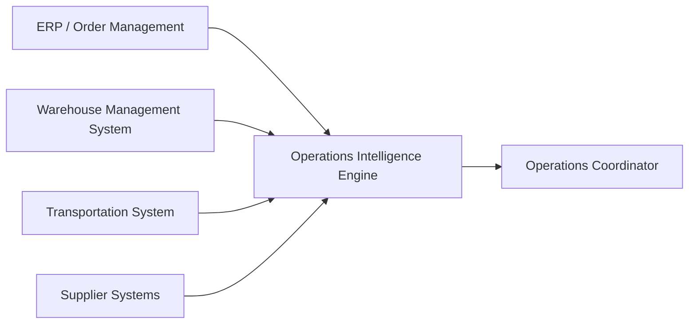

# Operations Intelligence Engine

A production-oriented TypeScript backend that maintains an explainable view of operational state across an industrial distribution network.

The engine consumes business events originating from systems such as order management, warehouse management, supplier, and transportation systems. It combines those facts to answer operational questions that no individual source system can answer alone.

The project is organized around operational decisions rather than CRUD resources.

## Primary user

The initial user is an operations coordinator responsible for ensuring customer orders ship on time.

Their work requires understanding disruptions across customer demand, warehouse inventory, inbound supply, and transportation without manually reconciling several independent systems.

## First operational question

> Which open customer orders cannot currently be fulfilled by their required ship date, and what operational conditions are preventing fulfillment?

The system must return more than a blocked status. It should explain:

* which order lines are affected;
* the required and available quantities;
* the projected shortfall;
* which inventory, reservation, or inbound-supply conditions caused it;
* what changed to produce the current result.

## Business context

The initial domain is a midsize industrial distributor.

The company:

* purchases industrial products from suppliers;
* stores inventory across multiple warehouses;
* accepts customer orders containing one or more product lines;
* commits available and expected supply to customer demand;
* experiences shortages, supplier delays, inventory discrepancies, and competing orders;
* needs operations employees to understand which customer commitments are at risk.

The distributor's customers are primarily other businesses. A delayed industrial component may prevent a factory, repair company, construction operation, or other customer from completing its own work.

## Where the engine fits

Existing operational systems remain authoritative for the business facts they manage.

Examples include:

* an ERP or order-management system for customer orders and commercial commitments;
* a warehouse management system for physical inventory and warehouse activity;
* supplier systems for purchase-order commitments and inbound supply;
* transportation systems for shipment status and delays.

The Operations Intelligence Engine sits downstream from these systems.



The upstream systems provide facts. The engine derives operational impact and explanations.

## First vertical slice

The first slice follows a customer order that depends on an inbound supplier shipment.

Initially:

* current warehouse inventory and expected inbound inventory are sufficient to fulfill the order by its required ship date;
* the order is considered fulfillable.

Then:

* the inbound shipment is delayed beyond the required ship date;
* projected supply becomes insufficient;
* the order becomes blocked;
* the engine identifies the affected SKU, quantity shortfall, delayed shipment, and relevant dates.

The scenario is implemented as an executable specification, automated test, and deterministic command-line demonstration.

## Running the scenario

Install dependencies and run the included shipment-delay scenario:

```bash
npm install
npm run scenario
```

The runner applies each business event in order, recalculates fulfillment after every event, and prints order status transitions with their supply contributions and blockers. This exposes every intermediate state rather than skipping directly to a curated before-and-after result.

```text
Scenario: shipment-delay-blocks-order
An inbound shipment moves past an order deadline, changing the order from fulfillable to blocked.

[1/4] InventoryPositionReported (event-inventory-1001)
CHI / BEARING-440: 70 usable, 0 reserved, 0 unusable
No orders to assess.

[2/4] OrderPlaced (event-order-1001)
SO-1001: 100 BEARING-440 units required from CHI by 2026-08-08T17:00:00-05:00

SO-1001: initial assessment BLOCKED
Required ship time: 2026-08-08T17:00:00-05:00
  SO-1001-L1 / BEARING-440 / CHI
    Required: 100
    Projected allocation: 70
      - 70 on hand at CHI
    Shortfall: 30
    Blocker: 30 units have no identified supply source

[3/4] InboundShipmentConfirmed (event-inbound-1001)
IN-900: 30 BEARING-440 units expected at CHI on 2026-08-06T09:00:00-05:00

SO-1001: BLOCKED -> FULFILLABLE
Required ship time: 2026-08-08T17:00:00-05:00
  SO-1001-L1 / BEARING-440 / CHI
    Required: 100
    Projected allocation: 100
      - 70 on hand at CHI
      - 30 from IN-900, expected 2026-08-06T09:00:00-05:00
    Shortfall: 0

[4/4] InboundShipmentDelayed (event-inbound-1001-delayed)
IN-900: delayed from 2026-08-06T09:00:00-05:00 to 2026-08-11T09:00:00-05:00

SO-1001: FULFILLABLE -> BLOCKED
Required ship time: 2026-08-08T17:00:00-05:00
  SO-1001-L1 / BEARING-440 / CHI
    Required: 100
    Projected allocation: 70
      - 70 on hand at CHI
    Shortfall: 30
    Blocker: 30 units on IN-900 arrive at 2026-08-11T09:00:00-05:00, after the required ship time
```

A later HTTP interface will receive events from upstream systems and expose current fulfillment assessments to clients.

## Current status

The in-memory fulfillment core for the first vertical slice is implemented.

The system currently:

* applies order, inventory, inbound-shipment, and shipment-delay events to operational state;
* allocates on-hand and timely inbound supply by deterministic demand priority;
* reports order- and line-level fulfillment status, projected allocation, and shortfall;
* explains late inbound supply, supply consumed by higher-priority demand, and undetermined shortfalls;
* preserves shipment delays as triggering changes when they explain a blocker;
* runs a deterministic shipment-delay scenario event by event.

PostgreSQL persistence, external event ingestion, and an HTTP API are intentionally deferred until after this engine checkpoint.

## Documentation

* [`docs/domain-overview.md`](docs/domain-overview.md) — business context, users, terminology, and scope
* [`docs/ecosystem.md`](docs/ecosystem.md) — upstream systems and the engine's place in the operational ecosystem
* [`docs/product-journey.md`](docs/product-journey.md) — journey of one industrial product from supplier to customer
* [`docs/vertical-slice-01.md`](docs/vertical-slice-01.md) — working specification for the first vertical slice
* [`docs/scenarios/shipment-delay-blocks-order.md`](docs/scenarios/shipment-delay-blocks-order.md) — first concrete business scenario
* [`docs/journal/01-unfulfillable-orders.md`](docs/journal/01-unfulfillable-orders.md) — engineering decisions, discoveries, AI usage, and implementation notes

## Engineering approach

The project follows several constraints:

* understand the operational domain before designing software;
* model concrete business scenarios before general abstractions;
* treat events as evidence about business reality, not as the product itself;
* keep source-system facts separate from derived operational conclusions;
* make business rules and assumptions explicit;
* produce explanations that an operations employee can act on;
* implement one complete vertical slice before expanding the domain;
* defer infrastructure and architectural complexity until the problem requires it.

## Technology direction

The planned stack is:

* TypeScript
* Node.js
* PostgreSQL
* automated scenario and integration testing

Architecture and infrastructure choices will be introduced incrementally as the first slice exposes concrete requirements.
