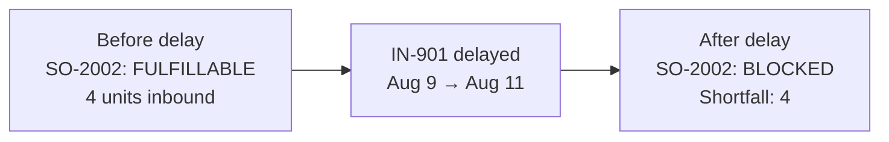
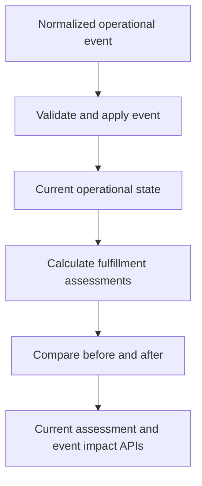

# Operations Intelligence Engine

An explainable TypeScript backend that combines orders, warehouse inventory, inbound supply, and transportation events to identify customer commitments at risk.

The project is organized around operational decisions rather than CRUD resources.

## What it answers

For an operations coordinator, the engine answers two related questions:

> Which open customer orders cannot currently be fulfilled by their required ship time, and why?

> When an operational event arrives, which fulfillment assessments changed because of it?

It returns structured evidence—not only a status—including projected allocation, shortfall, supply provenance, blocking conditions, and relevant triggering changes.

## Example: a shipment delay blocks an order



The order must ship by August 10. Before the delay, four inbound units are expected on August 9 and complete its projected allocation. When the shipment moves to August 11, those units become too late and the order becomes blocked.

The event-ingestion response identifies the transition and preserves its evidence:

```json
{
  "eventId": "delay-IN-901",
  "status": "APPLIED",
  "impact": {
    "changedOrders": [
      {
        "orderId": "SO-2002",
        "type": "BECAME_BLOCKED",
        "before": {
          "status": "FULFILLABLE"
        },
        "after": {
          "status": "BLOCKED"
        },
        "changedLines": [
          {
            "orderLineId": "SO-2002-L1",
            "before": {
              "projectedAllocation": 4,
              "projectedShortfall": 0
            },
            "after": {
              "projectedAllocation": 0,
              "projectedShortfall": 4,
              "blockingConditions": [
                {
                  "type": "INBOUND_AVAILABLE_TOO_LATE",
                  "shipmentId": "IN-901"
                }
              ],
              "triggeringChanges": [
                {
                  "type": "SHIPMENT_DELAYED",
                  "shipmentId": "IN-901"
                }
              ]
            }
          }
        ]
      }
    ]
  }
}
```

The complete scenario is implemented as an executable specification, focused tests, and an end-to-end HTTP test.

## How it works



Events represent facts learned from upstream systems. The engine maintains a current operational projection, allocates matching supply across prioritized demand, and produces structured explanations for its conclusions.

The upstream ERP, warehouse, supplier, and transportation systems remain authoritative for the facts they manage. This service derives cross-system operational impact.

## Implemented capabilities

- Ingest normalized `OrderPlaced`, `InventoryPositionReported`, `InboundShipmentConfirmed`, and `InboundShipmentDelayed` events.
- Validate event structure and state-transition consistency.
- Treat repeated event IDs as duplicates within the current process.
- Maintain current orders, inventory positions, inbound shipments, and represented shipment changes.
- Allocate on-hand and timely inbound supply without double-counting units across orders.
- Prioritize demand deterministically by required ship time, placement time, order ID, and line ID.
- Return order- and line-level fulfillment status, projected allocation, and shortfall.
- Explain late inbound supply, supply consumed by higher-priority demand, and otherwise undetermined shortfalls.
- Compare assessments before and after an event.
- Classify orders as added, removed, newly blocked, newly fulfillable, or changed in material detail.
- Return immediate event impact through the ingestion API.

## HTTP API

```http
POST /v1/operational-events
GET /v1/fulfillment-assessments
```

`POST /v1/operational-events` applies a normalized event and returns its immediate fulfillment impact. Duplicate events return `DUPLICATE` with no new impact.

`GET /v1/fulfillment-assessments` returns the explainable current assessment for every open order.

The HTTP behavior is currently exercised through Fastify integration tests using `app.inject()`; the repository does not yet expose a standalone deployed server.

## Run and verify

Requirements: Node.js 22 and npm.

```bash
npm install
npm run scenario
npm run verify
```

Run one executable scenario:

```bash
npm run scenario -- shipment-delay-blocks-order
```

`npm run verify` checks formatting, runs the automated tests and executable scenarios, and typechecks the project. The same checks run in GitHub Actions.

## Current business rules

| Rule | Current behavior |
|---|---|
| Warehouse scope | Each order line uses one fulfillment warehouse; supply does not move between warehouses. |
| On-hand availability | `max(0, usableQuantity - reservedQuantity)`; unusable inventory does not contribute. |
| Inbound eligibility | Confirmed inbound supply contributes only when available by the required ship time. |
| Demand priority | Earlier required ship time, then earlier placement time; IDs provide deterministic tie-breaking. |
| Supply use | On-hand supply is allocated before timely inbound supply. |
| Order status | An order is fulfillable only when every line has zero projected shortfall. |
| Explanation | Structured blocker quantities account for the shortfall without exceeding it. |
| Projection boundary | Projected allocation does not create an upstream reservation. |

## Current limitations

- Accepted events and operational state exist only in memory and do not survive restart.
- Duplicate detection is not durable across restarts.
- Concurrent ingestion and multiple service instances are not yet coordinated.
- Only the latest represented availability change is retained for each shipment.
- Event-impact attribution describes the immediate before-and-after change in this sequential service; it is not yet persisted history.
- Customer priority, transfers, split fulfillment, substitutions, cancellations, and recovery recommendations are outside the current scope.

The committed next milestone is durable operational state: persist accepted events in PostgreSQL, enforce durable event identity, and reconstruct the same operational projection through deterministic replay.

## Documentation

- [`docs/domain-overview.md`](docs/domain-overview.md) — business context, users, terminology, and scope
- [`docs/ecosystem.md`](docs/ecosystem.md) — upstream systems and the engine's place in the operational ecosystem
- [`docs/product-journey.md`](docs/product-journey.md) — journey of one industrial product from supplier to customer
- [`docs/vertical-slice-01.md`](docs/vertical-slice-01.md) — first vertical-slice specification
- [`docs/fulfillment-rules.md`](docs/fulfillment-rules.md) — allocation and explanation rules
- [`docs/scenarios/`](docs/scenarios/) — documented executable business scenarios
- [`docs/journal/01-unfulfillable-orders.md`](docs/journal/01-unfulfillable-orders.md) — engineering decisions, discoveries, and implementation notes
- [`docs/roadmap.md`](docs/roadmap.md) — completed, committed, candidate, and deferred milestones

## Technology

- TypeScript
- Node.js
- Fastify
- TypeBox
- Vitest
- GitHub Actions
- PostgreSQL planned for the next milestone

