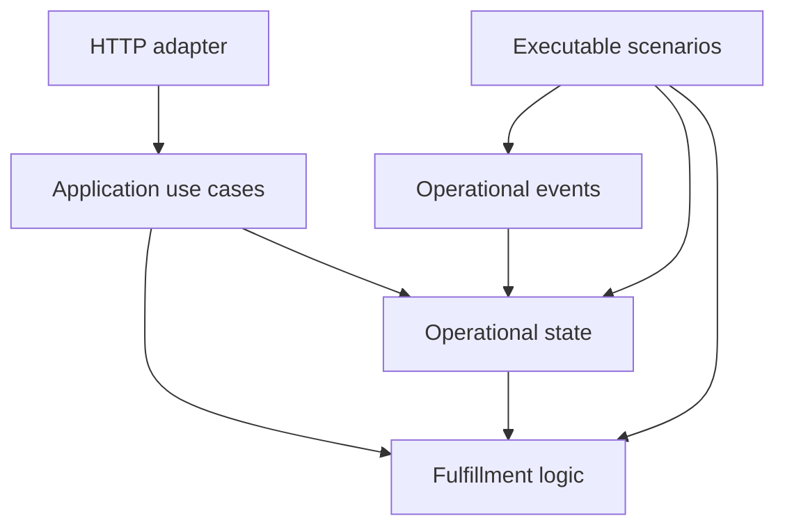

# Code Structure

```mermaid
flowchart TD
    HTTP["HTTP adapter"] --> APP["Application use cases"]
    APP --> STATE["Operational state"]
    APP --> FUL["Fulfillment logic"]
    EVENTS["Operational events"] --> STATE
    STATE --> FUL
    SCENARIOS["Executable scenarios"] --> EVENTS
    SCENARIOS --> STATE
    SCENARIOS --> FUL
```
