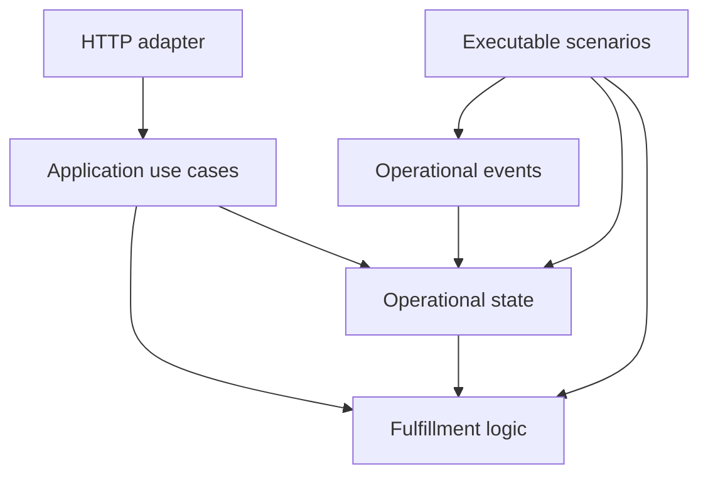

# Code Structure

The project uses a layered structure. Each directory owns a distinct part of the system, and dependencies generally point from external interfaces toward the core business logic.

## Directory responsibilities

| Directory      | Responsibility                                                                                        |
| -------------- | ----------------------------------------------------------------------------------------------------- |
| `events`       | Defines normalized operational facts received from upstream systems.                                  |
| `state`        | Defines current operational state and the rules for applying events to that state.                    |
| `fulfillment`  | Calculates fulfillment assessments and compares assessments before and after a change.                |
| `application`  | Coordinates complete use cases using state and fulfillment behavior.                                  |
| `http`         | Maps HTTP requests to application use cases and converts results and errors into HTTP responses.      |
| `scenarios`    | Provides executable examples that demonstrate business behavior using representative event sequences. |
| `test`         | Verifies source behavior and generally mirrors the structure of `src`.                                |
| `test/support` | Provides reusable test factories and other test-only helpers.                                         |

## Dependency flow

HTTP is an external adapter. It may depend on application and core domain behavior, but state and fulfillment logic must not depend on HTTP.

Application functions coordinate operations such as processing an event or retrieving current assessments. They do not define transport-specific request or response formats.

State stores the current operational projection. Fulfillment reads that projection and derives explainable assessments without modifying it.

Scenarios call the core behavior directly so they can demonstrate the business rules without requiring an HTTP server.

## Type and utility ownership

Types are colocated with the concepts that own them rather than placed in a general `types` directory.

Examples:

- `events/operational-event.ts` owns operational event types.
- `state/operational-state.ts` owns current operational state types.
- `fulfillment/fulfillment-assessment.ts` owns fulfillment assessment and explanation types.
- `fulfillment/fulfillment-assessment-comparison.ts` owns assessment comparison types.

Shared functions should remain with the concept whose rules they implement. A general utility module should only be introduced when behavior is genuinely independent of the existing sections.

## HTTP application construction

`http/build-app.ts` is the HTTP composition root. It creates the Fastify application, installs error handling, provides dependencies such as operational state and the system clock, and registers routes.

It does not start a network listener. This allows the complete HTTP application to be exercised through integration tests without running a standalone server.
