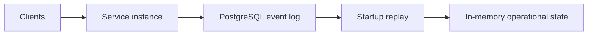
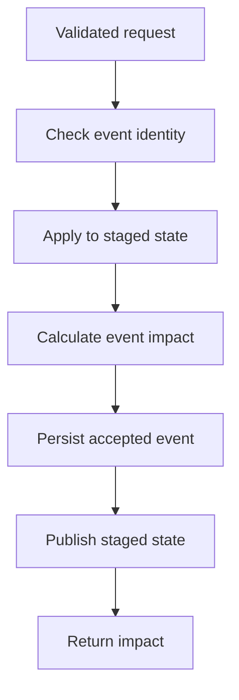

# Durable Operational State

## Purpose

The service must preserve and reconstruct its operational understanding across process restarts.

Accepted normalized events will be stored durably. On startup, the service will replay those events in a deterministic order to rebuild its in-memory operational state and produce the same current fulfillment assessments.

## Required guarantees

- Accepted events survive application restarts.
- Each accepted event has a durable, unique event ID.
- Reusing an event ID with identical normalized content returns `DUPLICATE`.
- Reusing an event ID with different normalized content returns a conflict.
- Accepted events replay in a deterministic order.
- Replay reconstructs the same operational state and fulfillment assessments.
- Failed or rejected events are not partially accepted.
- The service does not answer operational queries until startup replay completes.
- Fulfillment assessments and event-impact results remain derived rather than persisted.

## Runtime model

The durable-state milestone supports one active service instance connected to one PostgreSQL database.

## Persistence model

PostgreSQL stores an append-only log of accepted normalized operational events.

Each accepted event record contains:

| Field                 | Purpose                                                                                     |
| --------------------- | ------------------------------------------------------------------------------------------- |
| `replay_sequence`   | Database-generated unique sequence defining deterministic replay order.                     |
| `event_id`          | Producer-assigned event identity used for durable idempotency.                              |
| `event_fingerprint` | Hash of the stable event content, excluding`eventId` and server-generated `receivedAt`. |
| `event_data`        | Complete accepted normalized event stored as JSONB and used during replay.                  |
| `accepted_at`       | Database timestamp recording when the event was durably accepted.                           |

`event_id` has a unique constraint. The fingerprint is not unique.

When an incoming event reuses an existing event ID:

- a matching fingerprint means the delivery is an identical retry;
- a different fingerprint means the event ID has been reused with conflicting content.

The complete event data is required for replay. The fingerprint supports comparison but cannot reconstruct the event.

The event log does not initially store fulfillment assessments or event-impact results. Those remain derived from the replayed operational state.

## Event acceptance flow

The service stages each new event before accepting it so failed persistence cannot leave the live in-memory projection ahead of the durable event log.

## Transaction and failure boundaries

Each accepted event initially requires one append-only database insert. A single PostgreSQL statement is atomic and runs within an implicit transaction, so an explicit multi-statement transaction is not required merely to prevent a partially inserted row.

The `event_id` unique constraint is the final authority for event identity. Event acceptance uses an insert with conflict handling:

- a returned inserted row means the event was durably accepted;
- no inserted row means the event ID already exists;
- the existing fingerprint is then compared to classify the request as `DUPLICATE` or `CONFLICT`.

An early event-ID lookup may avoid unnecessary staging, but it is not authoritative because another request could insert the event after the lookup. The final constrained insert handles that race.

If the insert fails for any other reason, staged state is discarded and live state remains unchanged.

## Concurrent event acceptance

The milestone supports one active service instance, but that instance may receive overlapping HTTP requests.

Event acceptance will be serialized inside the process. Only one request at a time may perform the state-dependent acceptance sequence:

1. check durable event identity;
2. copy current live state;
3. apply the event to staged state;
4. calculate event impact;
5. persist the accepted event;
6. publish staged state.

HTTP validation and creation of the stable event fingerprint may occur before entering the serialized section.

The initial implementation will use an in-process asynchronous queue or mutex. Database-backed coordination between multiple active service instances is deferred.

Queries continue reading the current live state while an event is staged and persisted. They see either the state before publication or the state after publication, never the temporary staged state.

## Startup replay and readiness

On startup, the service:

1. establishes its PostgreSQL connection;
2. loads accepted events ordered by `replay_sequence`;
3. creates empty operational state;
4. applies each event in replay order;
5. exposes the reconstructed state as live state;
6. becomes ready to answer requests.

If an accepted event cannot be decoded or replayed, startup fails. The service must not silently skip the event or serve a partial projection.

The initial service does not accept requests while replay is incomplete.

## Integration-test plan

Database-backed tests will verify:

- an accepted event is stored with complete normalized event data;
- accepted events load in deterministic replay order;
- an identical event ID and fingerprint is classified as `DUPLICATE`;
- an event ID reused with different content is classified as `CONFLICT`;
- rejected business events are not persisted;
- database failure leaves live state unchanged;
- replay reconstructs the same operational state and fulfillment assessments;
- restarting preserves duplicate recognition.

Concurrent multi-instance behavior remains deferred.

## Deferred concerns

This milestone does not implement:

- multiple active service instances;
- synchronization between multiple in-memory projections;
- row-level business-resource locking;
- persisted fulfillment assessments;
- persisted event-impact results;
- event-log deletion or mutation;
- Kafka or another message broker;
- historical audit endpoints;
- production observability and deployment infrastructure.
