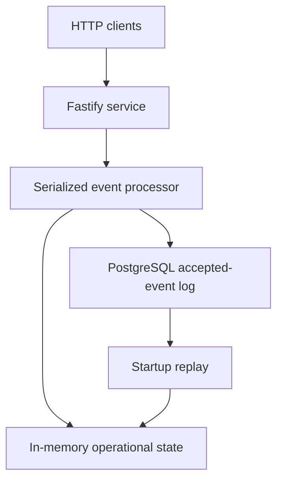
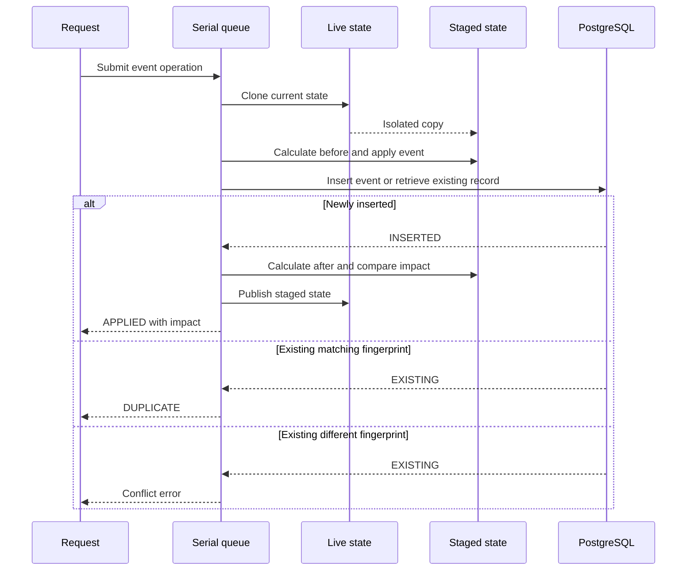
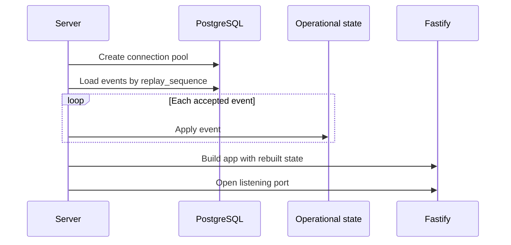

# Durable Operational State

## Purpose

The service preserves and reconstructs its operational understanding across process restarts.

PostgreSQL stores accepted normalized events as durable history. The service replays those events to rebuild its in-memory operational state before it begins accepting HTTP requests.

This architecture answers:

> Can the service preserve and reconstruct the same operational understanding across restarts without allowing failed event processing to corrupt live state?

## Implemented guarantees

- Accepted events survive application restarts.
- Each accepted event has a durable, unique event ID.
- Reusing an event ID with identical normalized content returns `DUPLICATE`.
- Reusing an event ID with different normalized content returns a conflict.
- Accepted events replay in a deterministic database-assigned order.
- Replay reconstructs operational state before the HTTP port opens.
- Invalid replay history prevents startup instead of producing partial state.
- Validation or persistence failures leave live state unchanged.
- Overlapping event requests are serialized within one Node.js process.
- Fulfillment assessments and event-impact results remain derived rather than persisted.

## Runtime model

The current runtime supports one active service instance connected to one PostgreSQL database.



PostgreSQL and operational state have different responsibilities:

| Component                   | Responsibility                                         |
| --------------------------- | ------------------------------------------------------ |
| PostgreSQL event log        | Durable record of accepted normalized events           |
| In-memory operational state | Current projection reconstructed from those events     |
| Fulfillment calculator      | Derived assessment of current order fulfillment        |
| Event-impact comparison     | Derived before-and-after result for one accepted event |

The event log is the durable source of truth. Operational state and fulfillment results can be reconstructed from it.

## Persistence model

PostgreSQL stores an append-only log of accepted normalized operational events.

Each accepted-event record contains:

| Field               | Purpose                                                          |
| ------------------- | ---------------------------------------------------------------- |
| `replay_sequence`   | Database-generated sequence defining deterministic replay order  |
| `event_id`          | Producer-assigned identity used for durable idempotency          |
| `event_fingerprint` | Hash of stable normalized event content                          |
| `event_data`        | Complete normalized event stored as JSONB and used during replay |
| `accepted_at`       | Database timestamp recording durable acceptance                  |

The `event_id` column has a unique constraint. The fingerprint is not unique.

The complete event is serialized to JSON and stored in `event_data`. The fingerprint supports identity comparison but cannot reconstruct the event.

Fulfillment assessments and event-impact results are not stored. They remain derived from the operational state produced by the accepted-event history.

## Stable event identity

A stable fingerprint is calculated from normalized event content while excluding:

- `eventId`, because it is the identity being checked;
- server-generated `receivedAt`, because retries may receive a different ingestion timestamp.

Object keys are serialized deterministically so equivalent normalized content produces the same fingerprint regardless of property insertion order.

When an incoming event reuses an existing event ID:

| Existing record        | Fingerprint comparison | Result      |
| ---------------------- | ---------------------- | ----------- |
| No record with that ID | Not applicable         | `APPLIED`   |
| Record with that ID    | Fingerprints match     | `DUPLICATE` |
| Record with that ID    | Fingerprints differ    | Conflict    |

Duplicate recognition is durable because the comparison uses the persisted event record rather than only the in-memory `processedEventIds` set.

## Event-acceptance flow



For a newly accepted event, the service:

1. waits until the preceding queued event operation finishes;
2. clones the current live state;
3. calculates fulfillment assessments before the event;
4. validates and applies the event to staged state;
5. attempts to insert the normalized event in PostgreSQL;
6. calculates the resulting assessments and event impact;
7. replaces the contents of live state with staged state;
8. returns `APPLIED` with the immediate impact.

The complete state-dependent operation runs inside the serial queue.

## State staging

An incoming event is not applied directly to live state.

`cloneOperationalState()` uses `structuredClone()` to create an isolated copy of the state, including its maps, set, and nested domain objects. Event application mutates this staged copy.

If validation fails, staged state is discarded.

If PostgreSQL insertion fails, staged state is discarded.

If PostgreSQL reports an existing event with the same fingerprint, the service returns `DUPLICATE` without publishing staged state.

If PostgreSQL reports an existing event with a different fingerprint, the service throws an event-identity conflict without publishing staged state.

Only a newly inserted event causes `replaceOperationalState()` to publish the staged maps and set into the existing live-state container.

The live state object itself is preserved. This matters because the HTTP routes and event processor already hold references to that object.

## Database acceptance boundary

Event insertion uses:

```sql
INSERT INTO accepted_events (...)
VALUES (...)
ON CONFLICT (event_id) DO NOTHING
RETURNING ...
```

A returned row means the event was newly inserted.

If no row is returned, the repository loads the existing record and returns it for fingerprint comparison.

The unique constraint on `event_id` is the final authority for event identity. This remains correct if two requests attempt to insert the same ID because PostgreSQL decides which insert succeeds.

The insert is one atomic PostgreSQL statement. A separate explicit transaction is not required to protect a single event row from partial insertion.

## In-process concurrency

One service process may receive overlapping HTTP requests.

Without coordination, two requests could both clone the same live state, independently apply different events, and publish incompatible results. Whichever request published last could erase the other request’s state change.

`AsyncSerialQueue` prevents that lost-update sequence. Each operation waits for the previous operation’s completion promise before accessing live state.

The queue releases the next operation in a `finally` block. A failed operation therefore rejects its own request without permanently blocking later operations.

HTTP validation and fingerprint creation can occur before entering the queue because they do not mutate or depend on live operational state.

Queries read the current live state while another event is staged. They see the state either before publication or after publication, never the temporary staged state.

## Concurrency boundary

The current guarantee applies only within one Node.js process.

The serial queue does not coordinate:

- multiple Node.js processes;
- multiple containers;
- multiple deployed service instances;
- another process accepting an event into the same PostgreSQL log.

Each service instance would maintain its own in-memory state and its own queue. Supporting multiple active instances requires database-backed coordination, projection versioning, synchronization, or another explicit consistency design.

## Startup replay



The repository loads accepted events using:

```sql
ORDER BY replay_sequence ASC
```

The replay operation:

1. loads accepted events from PostgreSQL;
2. creates empty operational state;
3. applies each event in replay order;
4. returns the reconstructed state.

Replay preserves persisted acceptance order. It does not attempt to infer dependencies, reorder events, repair history, or skip invalid records.

If an accepted event cannot be applied, startup fails and the HTTP server does not begin listening.

## Runtime lifecycle

The server entrypoint:

1. validates runtime configuration;
2. creates the PostgreSQL connection pool;
3. creates the accepted-event repository;
4. rebuilds operational state;
5. builds the Fastify application with that state and repository;
6. opens the configured HTTP port;
7. registers shutdown handlers.

`DATABASE_URL` is required. `HOST` defaults to `0.0.0.0`, and `PORT` defaults to `3000`.

If startup fails after resources have been created, the server attempts to close both the Fastify application and database pool.

On `SIGINT` or `SIGTERM`, shutdown stops the Fastify server and closes the database pool. Repeated shutdown signals do not start duplicate shutdown operations.

## Local database infrastructure

Docker Compose defines two PostgreSQL services:

| Service          | Host port | Database                       | Persistence                  |
| ---------------- | --------: | ------------------------------ | ---------------------------- |
| Development      |    `5432` | `operations_intelligence`      | Named Docker volume          |
| Integration test |    `5433` | `operations_intelligence_test` | Disposable container storage |

Both services mount:

```text
./db/migrations → /docker-entrypoint-initdb.d
```

The official PostgreSQL image executes SQL files in `/docker-entrypoint-initdb.d` when it initializes a new database data directory.

These scripts initialize new local databases. They are not a complete version-tracked migration system and do not automatically apply later migrations to an already initialized persistent development volume.

Integration-test files run sequentially because they share one test database and truncate the same tables between tests.

## Verification

Automated tests cover:

- accepted-event insertion and retrieval;
- deterministic replay ordering;
- successful state reconstruction;
- failure when persisted history cannot be replayed;
- identical-event duplicate classification;
- conflicting event-ID reuse;
- rejected events remaining unpersisted;
- database failure leaving live state unchanged;
- publication through the existing live-state reference;
- overlapping request serialization;
- queue continuation after a rejected operation;
- HTTP duplicate and conflict behavior;
- runtime construction from replayed state;
- startup configuration validation.

The completed manual runtime demonstration verifies:

```text
start PostgreSQL
→ start service
→ ingest inventory and order events through HTTP
→ query current fulfillment assessments
→ stop the Node.js process
→ restart the service
→ recover the same assessments
→ resend an accepted event
→ receive DUPLICATE
```

## Deliberate tradeoffs

Persisting accepted events while deriving current state provides:

- durable event identity;
- deterministic recovery;
- a durable input history;
- one authoritative persisted representation;
- the ability to recalculate projections as business rules evolve.

The main tradeoffs are:

- startup replay time grows with accepted-event history;
- replay uses the application’s current event-handling rules;
- current state is unavailable until replay finishes;
- multiple active service instances cannot safely maintain independent projections without more coordination.

Snapshots, projection versions, persisted impact history, or distributed coordination should be introduced only when concrete scale, audit, or deployment requirements justify their additional complexity.

## Deferred concerns

The current implementation does not provide:

- coordination between multiple active service instances;
- persisted fulfillment assessments;
- persisted event-impact results;
- historical assessment or impact queries;
- event-log deletion or mutation;
- projection snapshots;
- version-tracked database migrations;
- health or readiness endpoints;
- structured operational logging and metrics;
- automated deployment, backup, or recovery procedures;
- Kafka or another message broker.
