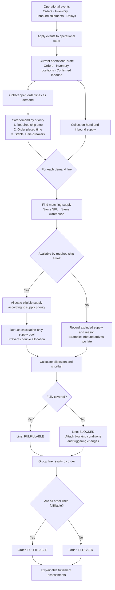

```mermaid
flowchart TD
    A["Operational events<br/>Orders · Inventory · Inbound shipments · Delays"]
    B["Apply events to operational state"]
    C["Current operational state<br/>Orders · Inventory positions · Confirmed inbound"]
    D["Collect open order lines as demand"]
    E["Collect on-hand and inbound supply"]
    F["Sort demand by priority<br/>1. Required ship time<br/>2. Order placed time<br/>3. Stable ID tie-breakers"]
    G{"For each demand line"}
    H["Find matching supply<br/>Same SKU · Same warehouse"]
    I{"Available by required ship time?"}
    J["Allocate eligible supply<br/>according to supply priority"]
    K["Reduce calculation-only supply pool<br/>Prevents double allocation"]
    L["Record excluded supply and reason<br/>Example: inbound arrives too late"]
    M["Calculate allocation and shortfall"]
    N{"Fully covered?"}
    O["Line: FULFILLABLE"]
    P["Line: BLOCKED<br/>Attach blocking conditions<br/>and triggering changes"]
    Q["Group line results by order"]
    R{"Are all order lines fulfillable?"}
    S["Order: FULFILLABLE"]
    T["Order: BLOCKED"]
    U["Explainable fulfillment assessments"]

    A --> B --> C
    C --> D
    C --> E
    D --> F --> G
    E --> G
    G --> H --> I
    I -- Yes --> J --> K --> M
    I -- No --> L --> M
    M --> N
    N -- Yes --> O
    N -- No --> P
    O --> Q
    P --> Q
    Q --> R
    R -- Yes --> S --> U
    R -- No --> T --> U
```
