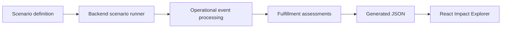

# Impact Explorer

## Purpose

The Impact Explorer is a read-only demonstration surface for the Operations
Intelligence Engine.

Its purpose is to help hiring managers and engineers understand the system's
business value without installing dependencies, starting PostgreSQL, or
interpreting raw API responses.

The explorer does not implement fulfillment logic. It presents results produced
by the existing scenario runner and operational engine.

## Audience

The primary audience is:

- hiring managers evaluating the project;
- engineers reviewing its design;
- people receiving a direct project link during job outreach.

## First scenario

The first vertical slice visualizes the existing
`shipment-delay-blocks-order` scenario.

The primary moment is the shipment delay that changes order SO-1001 from
`FULFILLABLE` to `BLOCKED`.

The explorer should show:

- operational events in replay order;
- the selected event and its triggering change;
- order status before and after the event;
- projected allocation before and after;
- projected shortfall before and after;
- supply contributions;
- blocking conditions;
- optional raw event data.

## Data flow

The Explorer uses a build-time demonstration adapter:

1. An existing scenario definition supplies the ordered operational events.
2. The backend processes those events through the same application and fulfillment logic used elsewhere in the project.
3. After each event, the scenario runner captures the event, resulting assessments, and before-and-after order impact.
4. The generated result is serialized as JSON.
5. The React application reads that JSON and presents the scenario as an interactive timeline.

The browser does not calculate fulfillment, replay domain events, or reproduce the backend’s business rules. It only selects and renders steps from the generated scenario output.

This boundary keeps the demonstration deployable as a static GitHub Pages site while preserving the backend as the source of all operational conclusions.

## Intentional constraints

The Explorer demonstrates one representative scenario. It is not intended to provide:

- arbitrary event or scenario editing;
- direct database access;
- a live connection to the Fastify server;
- authentication or user accounts;
- operational administration screens;
- customer-specific or production data.

A live API-backed interface could be added later, but it would add deployment and operational complexity without materially improving the current portfolio demonstration.

## Architecture constraints

- The backend engine remains the source of business decisions.
- The frontend must not calculate fulfillment status or allocation.
- Scenario definitions must not be duplicated in the frontend.
- The first slice should not require a running API or PostgreSQL database.
- Generated data must be reproducible from repository code.
- The result must be deployable as a public static site.

## First vertical slice acceptance criteria

A visitor can:

- open the explorer without setup or authentication;
- see the four events in the shipment-delay scenario;
- select an event from the timeline;
- see SO-1001 change from `FULFILLABLE` to `BLOCKED` after the delay;
- see projected allocation change from 100 to 70;
- see projected shortfall change from 0 to 30;
- understand that 30 inbound units arrive after the August 8 ship deadline;
- inspect the selected event's raw data;
- follow links to the repository and architecture documentation.

The explorer must obtain these values from generated engine output rather than
hard-coded frontend calculations.

## Non-goals

This milestone does not include:

- authentication or user accounts;
- order, inventory, or shipment CRUD;
- arbitrary scenario editing;
- customer or tenant management;
- production administration screens;
- new fulfillment business rules;
- live event ingestion;
- database access from the browser;
- multi-instance concurrency work;
- a general-purpose dashboard.

## Backend architecture presentation

The main interface explains the operational result rather than the internal
implementation.

A secondary section may briefly describe:

- durable accepted-event persistence;
- deterministic startup replay;
- duplicate and conflict handling;
- serialized processing within one service instance.

Detailed implementation material remains in the repository documentation.
