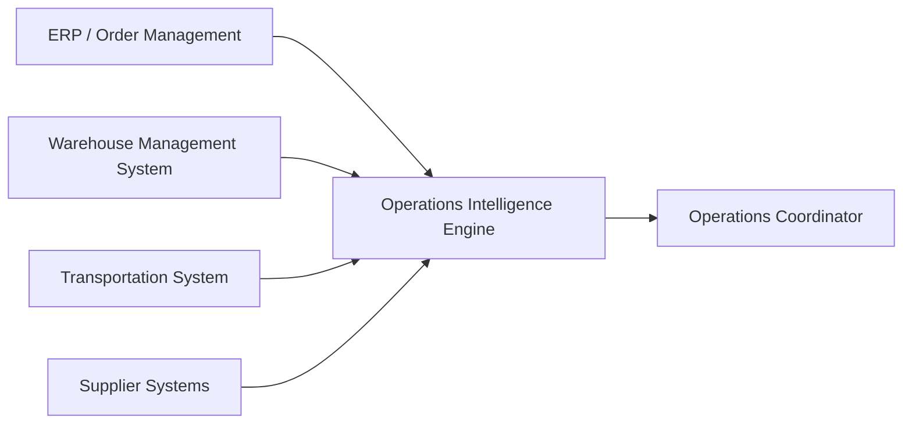

# Ecosystem

| System                         | Primary responsibility                                           | Example facts provided                                  |
| ------------------------------ | ---------------------------------------------------------------- | ------------------------------------------------------- |
| ERP / Order Management         | Customers, sales orders, purchase orders, commercial commitments | Order placed, order cancelled, required date changed    |
| WMS                            | Physical warehouse inventory and warehouse execution             | Inventory received, adjusted, reserved, picked, shipped |
| TMS / Carrier systems          | Transportation planning and shipment movement                    | Shipment dispatched, delayed, delivered                 |
| Supplier systems               | Supplier commitments and inbound supply                          | Purchase order acknowledged, inbound date changed       |
| Operations Intelligence Engine | Derived operational state and explanations                       | Order blocked, projected shortfall, reason for risk     |

## Principles

* Existing operational systems remain systems of record.
* The engine consumes their facts.
* The engine derives customer-order impact that may not exist in any one source system.
* The first project version simulates those integrations through typed operational events and executable scenarios.
* The project does not require actual SAP, WMS, or TMS connections.

